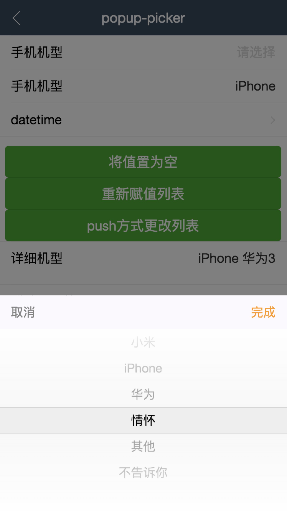
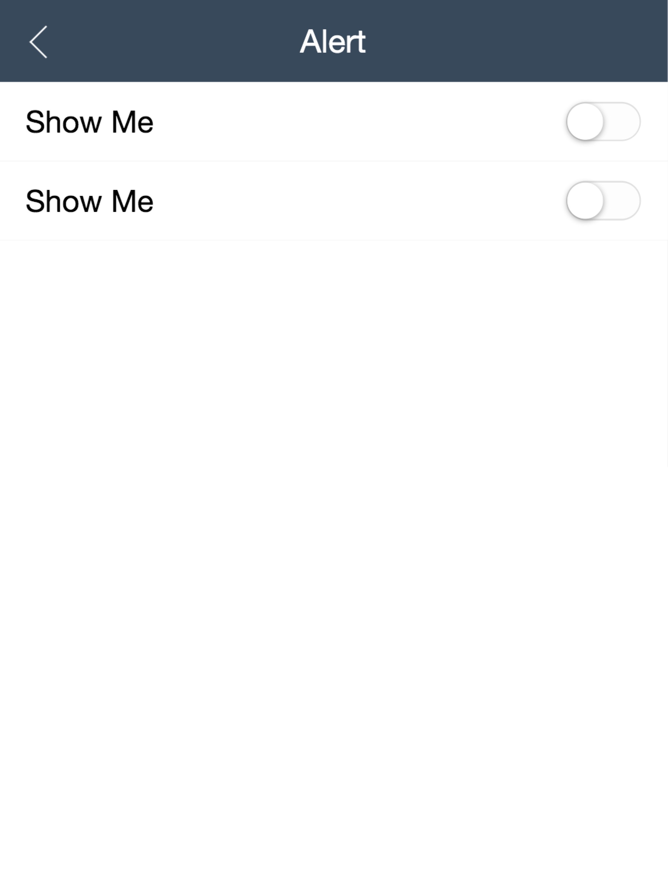

## 前言

在公司项目使用第三方UI组件库的时候，特别是在移动端，大部分是使用  postcss-pxtorem / postcss-px2rem-exclude 进行rem转换，有时候因为某一个功能组件而不得不在原有的组件库中再次引入一个第三方库，故而萌生自己编写一个UI组件库的想法，结合网上开源的lib-flexible进行改造，使其完全适用于rem单位，能更具灵活性，解决1px边框像素等问题，同时也是对自己的一个挑战，在困难中不断摸索前进

## 目标

希望能够作出一套在项目中投入使用的UI组件库

## 说明

如果对您有帮助，您可以点右上角 "Star" 支持一下 谢谢！ ^_^

或者您可以 "follow" 一下，我会不断开源更多的有趣的项目

如有问题请直接在 Issues 中提，或者您发现问题并有非常好的解决方案，欢迎 PR

##  部分截图

<h3>iphone6/7/8</h3>

  
  
  
  
  

<h3>iphone6/7/8plus</h3>

  
  
  
  
  

<h3>ipad</h3>

  
  
  
  
  

<h3>ipad pro</h3>

  
  
  
  
  

## 更多详细信息请点击下方链接

<h3>
  <a href="https://github.com/Qiuyaxian/lm-ui/tree/master/lm-angular">lm-angular</a>	
</h3>
<h3>
  <a href="https://github.com/Qiuyaxian/lm-ui/tree/master/lm-react">lm-react</a>	
</h3>
<h3>
  <a href="https://github.com/Qiuyaxian/lm-ui/tree/master/lm-vue">lm-vue</a>	
</h3>
